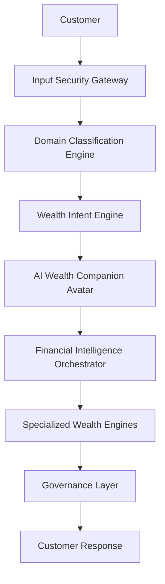

# NorthStar Wealth Companion
## Goal-Centric Financial Coaching For Every Investor

### NorthStar Wealth AI

---

# Foundational Product Insight

NorthStar Wealth Companion was not designed by starting with financial products, LLMs, or architecture diagrams. 
It was designed by starting with recurring investor behaviors observed through years of direct customer interactions and real RM field experience.

The solution is built around four recurring patterns:

1. **SIP Resilience Thesis**: SIP discontinuation is frequently caused by liquidity stress and life events (medical emergency, job loss, temporary income shock) rather than market fear. This insight drives the entire Financial Resilience Engine.
2. **Customer Question Taxonomy**: Investors communicate using goal-oriented questions ("Should I stop my SIP?", "Why isn't my portfolio growing?") rather than financial terminology. These real-world questions drive the Avatar training and intent detection.
3. **Field-Tested Financial Education**: Financial concepts become understandable when explained through relatable mental models that have *already proven effective* in real customer conversations (e.g., Compounding to Mango Tree, Diversification to Cricket Team, SIP to Sale Season).
4. **Behavioral Suitability By Life Stage**: Investor priorities and fears change significantly across life stages (20 to 35 fear missing growth; 35 to 50 fear balancing EMIs/goals; 60+ fear outliving savings). This influences suitability decisions far beyond standard risk scores.

These observations form the foundation of the product's architecture, conversational design, educational framework, behavioral coaching system, and financial resilience capabilities. 

> [!IMPORTANT]
> **The AI layer exists to scale these insights, not replace them.**

---

# Revised Differentiator Hierarchy

**Tier 1: Field-Derived Investor Intelligence (The Core Origin)**
* SIP resilience thesis
* Customer question taxonomy
* Mental model education
* Life-stage suitability

**Tier 2: Product Capabilities (The Output)**
* Financial resilience
* Goal planning
* Behavioral coaching
* Education

**Tier 3: AI Enablement (The Delivery Mechanism)**
* Avatar Experience
* Financial Twin
* LLM reasoning

**Tier 4: Trust Layer (The Guardrails)**
* Governance Framework
* Explainability
* Auditability

---

# New UX North Star
**"A Digital Financial Companion that helps Indian families understand, protect, and achieve their life goals."**

### UX Design Principles
1. **Life Outcomes First**: Never show raw financial concepts (like Goal Probability 78%) first. Show life outcomes ("You're on track to buy your home in 2034").
2. **No Meaningless Scores**: Never show raw scores (e.g., Emergency Readiness: 42). Translate them to impact ("Your savings cover about 2 months of expenses").
3. **Hide the Architecture**: Customers should never see "Financial Twin" or "Behavioral Engine" in the UI. Those are backend orchestration layers.
4. **Guided First, Chat Second**: The Avatar functions like an RM. It guides the user with contextual options (My Goals, Emergency Planning) before expecting free-text input. Cognitive load is the enemy.
5. **Assumption-Led Advisory Principle**: Demonstrate value before demanding data. Use available Twin data to make transparent assumptions, show a preliminary estimate, and then invite customer corrections rather than forcing a lengthy onboarding questionnaire.
6. **Progressive Disclosure & Cognitive Anchoring**: Prevent decision fatigue by using the top of the dashboard as an "Emotional Anchor" (Portfolio Value and Returns only), hiding complex diagnostic data (Risk Profile, Emergency Fund gaps, Goal tracking) inside a collapsible "Financial Details" drawer. Do not duplicate data across views.
7. **Responsive Omnichannel Integration**: The app must integrate seamlessly inside existing mobile banking real estate (full screen on mobile), while gracefully scaling to a premium, device-framed simulator layout on desktop browsers to prove cross-platform web/mobile readiness without breaking the core mobile-first UX.

---

# RM Augmentation (The B2B Value)
The Wealth Companion extends this field-tested personalized guidance to customers who currently lack dedicated advisory access, while simultaneously helping Relationship Managers (RMs) identify behavioral, resilience, and goal-completion opportunities to better serve their HNI clients. It does not replace RMs; it scales their capacity.

---

# High-Level Architecture

---

# Layer 0: Input Security Gateway
Role: First line of defense against adversarial prompt attacks.
Capabilities:
* Detects and blocks Prompt Injection (e.g., "Ignore previous instructions")
* Detects and blocks Roleplay Jailbreaks (e.g., "Act as an unregulated broker")
* Structural Separation (Wraps user input in XML `<user_input>` delimiters)

# Layer 1: Domain Classification Engine
Role: Ensure the conversation stays strictly within wealth management boundaries.
Capabilities:
* Allows: SIP, Mutual Funds, Retirement, Goal Planning.
* Rejects: Web Scraping, Medical Advice, Python Coding, Crypto Trading.

# Layer 2: Wealth Intent Engine
Role: Pre-classify the customer's financial intent before invoking the LLM.

---

# Layer 3: AI Wealth Companion Avatar

Role: Primary interaction interface and first-class product component. A continuous, humanized digital advisor persistent across all journeys.

Phase 1 Prototype Form:
**Professional 2D Digital Wealth Guide**
* Professional banking appearance.
* Static illustrations with state-based reactions: Greeting, Listening, Thinking, Explaining, Alerting.
* Typing animation and speech bubbles.
* Mobile-first interaction.

*Future Evolution*:
* Phase 2: Voice-enabled avatar.
* Phase 3: Multimodal avatar integrated into IDBI mobile ecosystem.

---

# Layer 4: Financial Twin Engine

A continuously evolving digital representation of a customer's financial life.

**POC Capabilities:**
* Goal Probability
* SIP Adequacy
* Emergency Readiness
* Risk Capacity
* Goal Health Score

**Sandbox Phase (Future):**
Consumes real IDBI APIs:
* Portfolio Data
* SIP History
* Customer Transactions
* Product Holdings

**Future Capabilities (Simulations):**
Simulate Job Loss, Medical Emergencies, or Market Drawdowns to project Goal Probability Changes and create Recovery Plans.

---

# The 7 Wealth Pillars (Execution Order)

## 1. Goal Intelligence Engine
Transforms life goals into investment roadmaps (Target Corpus, Investment Horizon, Required SIP).

## 2. Financial Resilience Engine
*Most differentiated insight derived from real RM experience.* Protects investment continuity because life events cause more SIP failures than market volatility.

**Remediation Framework (Detect -> Explain -> Recommend -> Connect):**
1. **Detect**: System detects low Emergency Fund (e.g., 2 Months vs 6 Months needed).
2. **Explain**: Generates an Emergency Readiness Alert, educating the user on the risk of SIP breaks during job loss.
3. **Recommend**: Suggests building a liquid safety net.
4. **Connect**: Routes directly to **IDBI Bank FD** or **IDBI Flexi Recurring Deposit**.

## 3. Avatar Experience
(See Layer 3)

## 4. Suitability Intelligence Engine
Matches Risk Profile and Asset Allocation Guidance strictly with user demographics. Principle: Suitability > Popularity.

## 5. Financial Education Engine
Translates financial complexity into simple language via visual analogies (e.g., Compounding = Mango Tree, SIP = Sale Season).

## 6. Behavioral Finance Engine
Detects psychological biases to prevent emotional investing decisions.

**POC Detection Rules (Triggers -> Bias):**
* Trigger: *"My friend made huge returns"* -> Detects **FOMO**
* Trigger: *"Everyone is investing there"* -> Detects **Herd Mentality**
* Trigger: *"Market is crashing"* -> Detects **Loss Aversion**
* Trigger: *"This fund was best last year"* -> Detects **Recency Bias**

## 7. Goal Achievement Accelerator
Increases probability of success by capitalizing on windfalls.
Example: Detects Salary Increase -> Recommends **Step-Up SIP** routed through **IDBI Mutual Fund** ecosystem.

---

# AI Reasoning Layer
Technology: Meta Llama 3.3 70B Instruct
Deployment: NVIDIA NIM API
Role: Reasons on top of structured outputs from wealth engines. Does not directly generate independent investment recommendations. Generates purely natural language responses adhering to governance constraints.

---

# Governance & Compliance Engine

> [!WARNING]
> **SEBI-Aware Governance Framework**
> Designed to be highly compliant, but claims "SEBI-Aware" rather than "SEBI-Certified" to avoid regulatory overclaiming prior to sandbox audit.

Checks:
* Suitability
* Explainability
* Risk Disclosures
* Blocks "Guaranteed returns" or "Assured performance" promises.

**Expanded Red Teaming Coverage:**
* Prompt Injection & Roleplay
* Bypassing Regex
* Panic Selling Advice
* Specific Stock Picking
* Off-Topic Tasks
* False Positive / False Negative Testing
* Financial Hallucination Testing
* Suitability Violations
* Portfolio Switching Manipulation
* Product Recommendation Abuse

---

# Business Viability & Economics
IDBI's retail wealth customer base includes a large segment with investable surplus under 5 lakh INR, below the threshold where dedicated RM coverage is economically viable. NorthStar Wealth Companion targets this underserved segment, extending advisory capacity without incremental RM cost, while freeing senior RMs to focus on HNI relationships.

# Compliance & Regulatory Standing
**Operating within IDBI Bank's existing AMFI/IA regulatory framework, not as a standalone advisory entity.** The system provides incidental advice and guidance embedded in the banking relationship, utilizing IDBI's existing execution infrastructure to ensure strict adherence to SEBI regulations.

# Production Roadmap: Addressing Intent Ambiguity & DPDP Compliance
*Status: Identified vulnerability to be solved in production scaling.*

**The Ambiguity Challenge in the Indian Market:**
The current Proof of Concept (PoC) relies on a zero-latency Regex/Lexical engine for intent classification. However, we acknowledge that Indian retail queries are highly fluid, deeply contextual, and multi-lingual (Hinglish). For instance, a tax advisory query like *"mein tax kaise bachau"* can evade strict deterministic regex boundaries designed for *"tax planning"*. Adding infinite regex permutations creates unmaintainable rule bloat and false positives.

**Production Solution (Semantic Telemetry Loop):**
For the live production environment, the L1 Regex engine will be replaced by a local, lightweight Semantic Embedding Model (e.g., BGE-m3). 
1. **Semantic Routing:** User intents will be matched mathematically (Cosine Similarity) rather than lexically, catching the *meaning* of *"tax bachana hai"* without relying on exact wording.
2. **Telemetry Collection & Active Learning:** Queries that fall below confidence thresholds will be gracefully escalated to human RMs but logged in a `MissedIntents` telemetry database for continuous model improvement.

**Strict DPDP Act Compliance & Data Privacy:**
To train this semantic engine ethically and legally under India's Digital Personal Data Protection (DPDP) Act:
* Explicit, upfront consent will be secured, notifying users that their interactions may be utilized for AI training and quality audits.
* All telemetry data collected for training will be strictly **anonymized**. A zero-trust PII-scrubber will remove all names, account numbers, amounts, and sensitive identifiers *before* logging the interaction to the `MissedIntents` database. The AI will train purely on the conversational structure, never on personal financial data.

# Scalability and Integration Readiness (Post-Shortlist Sandbox)
To integrate deeply into IDBI's mobile ecosystem, the architecture maps to the following API connections:

**Data Layer**
* Customer Profile API -> Financial Twin initialization
* Portfolio Holdings API -> Current allocation analysis  
* SIP Transaction History API -> Continuity risk scoring
* Account Balance API -> Emergency readiness calculation
* Product Catalog API -> Suitability-matched recommendations

**Action Layer**
* SIP Creation/Modification -> IDBI Mutual Fund infrastructure
* Step-Up SIP trigger -> Goal acceleration engine
* Audit Trail -> IDBI compliance systems

---

# Data Citation & Mocking Policy
**Verification of SIP Data:** All SIP parameters, portfolio holdings, emergency fund scores, and transaction histories used in this POC are **synthetically generated mock data**. 
* **Sources**: The architectural references to *IDBI Mutual Fund*, *IDBI Bank FDs*, and *IDBI Flexi Recurring Deposits* are cited publicly available product structures used for demonstrative routing purposes only.
* **Disclaimer**: No proprietary IDBI Bank customer data, live API endpoints, or live SIP transaction records are used in this prototype. The system operates entirely on pre-seeded, anonymized Sandbox Personas to ensure 100% compliance with data privacy regulations during the hackathon evaluation.

---

# Roadmap & Build Priority

### Must Build Before July 9 (Phase 1)
* **Avatar Interface**: Visual 2D companion with guided UX.
* **Guided Action Cards**: Contextual chips prioritizing goal outcomes over open chat.
* **Pre-seeded Personas**: Demonstrating assumption-led advisory.
* **Financial Twin Dashboard**: Hidden logic driving UI states.
* **Financial Resilience Engine**: Explicitly mapping life events (Medical, Job Loss).
* **Behavioral Coaching**: Field-tested analogies embedded in chat.
* **Governance Demonstration**: SEBI-aware safety rails.

### Explicitly Deferred for July 9 (Scope Discipline)
* Voice Interface
* Vernacular Support
* ASR (Automatic Speech Recognition)
* TTS (Text-To-Speech)
* Real-time Emotion Detection
* Multi-language Conversations

---

# Phase 2: Vernacular Wealth Companion (Post-Shortlist)
*Status: Planned post-shortlist enhancement following IDBI sandbox access.*

**Features:**
* **Voice-First Interactions**: Hands-free advisory for broader demographic reach.
* **Indian Language Support**: Localized interactions matching Tier-2+ mental models.
* **Code-Switching Handling**: Understanding mixed English-Hindi (Hinglish) financial queries natively.
* **Confidence-Gated Slot Filling**: Ensuring accurate data capture over voice.
* **Sarvam AI Integration**: Leveraging specialized Indian ASR models.
* **TTS Responses**: Voice synthesis in the customer's preferred language.
