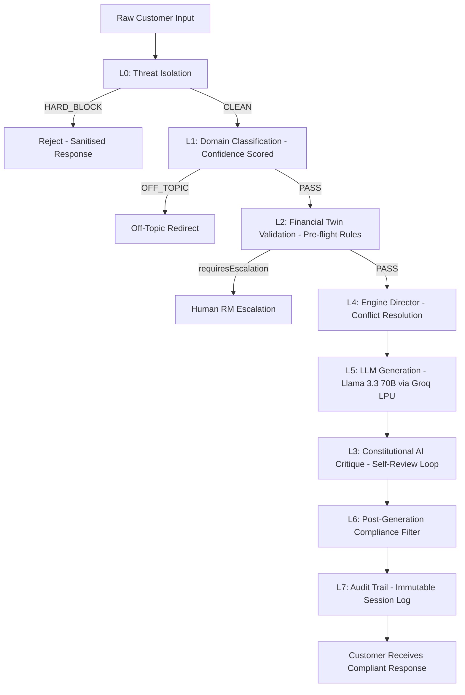

# NorthStar Wealth Companion


[](https://northstar-wealth-ai.netlify.app/)

An AI-powered Wealth Management interface built for the modern Indian investor. Designed as a Proof of Concept for the IDBI Innovate Hackathon.

> [!TIP]
> **Live Interactive App:** You can experience the fully responsive mobile banking prototype directly at **[northstar-wealth-ai.netlify.app](https://northstar-wealth-ai.netlify.app/)**.

## Video Walkthrough

[🎥 Watch the full 3-minute mobile app walkthrough on YouTube](https://youtu.be/AL3z0U6U8vM)

## Why This Project Exists

This solution originated from recurring investor behaviors observed through years of wealth advisory interactions.

Investors rarely ask:
- What is the optimal asset allocation?
- Which fund has the highest alpha?
- What is the expense ratio?

Instead, they ask:
- Should I stop my SIP?
- Why isn't my portfolio growing?
- Where should I invest my bonus?
- Am I investing correctly?
- Will I be able to retire comfortably?

Through these interactions, a recurring pattern emerged:  
**Financial products are abundant. Financial confidence is not.**

NorthStar Wealth Companion was created to bridge that gap by combining:
- Goal-Based Planning
- Financial Education
- Behavioral Coaching
- Financial Resilience Intelligence
- Explainable AI
- Governance-Aware Guidance

into a single investor-centric experience.

## What Makes This Different

Most wealth platforms are built around products.  
**NorthStar Wealth Companion is built around investor behavior.**

Key insights incorporated into the solution include:

### SIP Resilience Framework
One of the most overlooked realities in wealth management is that SIP discontinuation is not always caused by market panic. Common causes include:
- Medical emergencies
- Family obligations
- Cash-flow stress
- Unexpected expenses
- Lack of emergency reserves

The platform proactively identifies these risks and promotes financial resilience before investment discipline breaks down.

### Real Investor Question Taxonomy
The conversational architecture is modeled around actual investor questions rather than idealized financial terminology. This allows the system to interact naturally with retail investors and reduce cognitive barriers to investing.

### Behavioral Finance Layer
Designed to address FOMO, herd mentality, loss aversion, panic selling, performance chasing, and recency bias through contextual coaching and educational interventions.

### Financial Education Through Mental Models
The platform explains complex financial concepts using relatable analogies observed to resonate with investors:
- **Mango Tree** → Compounding
- **Sale Season** → SIP Cost Averaging
- **Cricket Team** → Diversification

The objective is comprehension, not complexity.

## Human + AI

The Wealth Companion is designed to **augment, not replace, Relationship Managers (RMs).**

It extends personalized guidance to customers who may not have access to dedicated advisory services, while providing immediate escalation pathways when human intervention is required for complex or emotionally charged queries.

## Designed For IDBI Innovate 2026

The solution is designed as a Proof of Concept for the IDBI Innovate 2026 Wealth Advisory Challenge. Future sandbox integration is intended to leverage:
- Customer profile data
- Portfolio data
- SIP history
- Transaction history

to create a continuously evolving Financial Twin and personalized guidance experience.

> [!IMPORTANT]
> **For detailed enterprise integration, DPDP Act compliance, and our strategy for scaling this to millions of IDBI users using Core Banking Systems, please read the [PRODUCTION SCALING ARCHITECTURE](docs/PRODUCTION_SCALING_ARCHITECTURE.md) document.**

---

## Architecture Philosophy



The AI model is intentionally treated as a **reasoning layer** rather than the source of financial guidance.

All responses are informed by:
- Financial Twin Context
- SEBI Governance Rules
- Behavioral Coaching Logic
- Financial Resilience Signals

This design allows the system to remain model-agnostic. Currently, the orchestrator utilizes **Groq LPU Inference** running `llama-3.3-70b-versatile` for deterministic zero-shot classification and rigorous compliance-enforced generation, achieving sub-second latency. NVIDIA NIM remains configured as a High Availability fallback.

### Groq LPU Performance Benchmarks
- **Model**: `llama-3.3-70b-versatile`
- **Time to First Token (TTFT)**: 169ms - 583ms
- **Total Latency**: < 1.0s
- **Input Tokens**: ~1,100 (Highly optimized, compressed prompt)
- **Output Tokens**: ~30-45 (Enforced by 50-word Conciseness Directive)
- **API Strategy**: Bypasses traditional serverless timeouts (e.g., Netlify's 10s limit) by streaming instantly.

## Testing Architecture & Quality Assurance

The governance pipeline is validated by an enterprise-grade test suite using **Vitest**. All 158 tests across 6 suites pass.

| Suite | Tests | What It Covers |
|---|---|---|
| `governance_extended.test.ts` | 90 | L1 extended classifications, L2 bounds checking, L4 complex multi-engine suppression rules, L6 regex edge cases, L7 audit session stats |
| `governance.test.ts` | 42 | L0 threat detection, L1 confidence classification, L2 preflight rules, L4 engine conflict resolution, L6 compliance filter |
| `constitution.test.ts` | 16 | L3 constitutional principle coverage, `requiresConstitutionalReview` gating logic, JSON parse failure fallback |
| `orchestrator.test.ts` | 3 | Full pipeline integration: suitability hard-rejection, off-topic routing, RM escalation |
| `mathematicalLimits.test.ts` | 2 | Deterministic goal feasibility — rejects mathematically impossible investment plans |
| `avatarStateManager.test.ts` | 5 | Avatar state machine race-condition and transition correctness |

Key coverage highlights:
- Semantic jailbreak detection (Jaccard similarity, not just regex)
- All 5 Financial Twin pre-flight block rules
- Engine Director conflict suppression (SUITABILITY overrides ACCELERATION, etc.)
- Constitutional critique fires correctly for high-risk intents and skips for low-risk

## Hackathon Submission Framing

**1. Mobile Banking Integration Architecture**
> "The IDBI Wealth Companion presented in this POC is built as a highly responsive, standalone progressive web application (React/Next.js) strictly constrained to a mobile viewport. This design choice was made to rapidly demonstrate the core conversational capabilities and behavioral engines. However, the production target architecture is a **modular, drop-in SDK (Software Development Kit)** designed specifically for seamless embedding within IDBI's existing native mobile banking applications (iOS/Android). The UI components and chat interfaces are loosely coupled from the banking dashboard, ensuring the IDBI Mobile Team can import the `WealthCompanion` module without disrupting existing banking workflows."

**2. Behavioral Telemetry & Spending Habits Feed**
> "To deliver highly personalized, timely advice, the system relies on deep behavioral telemetry. In this sandbox phase, the cashflow profile (Monthly Outflows, EMI Burden, Discretionary Spend) is mocked via static persona generation to demonstrate the mathematical routing of the Central Nervous System (CNS) layer. For the final production rollout, this telemetry layer is architected to ingest live transaction feeds from IDBI's core banking databases. This enables the engine to automatically compute the customer's true spending habits and trigger real-time, proactive nudges (e.g., detecting a salary credit and immediately recommending a Step-Up SIP before the capital is spent)."

**3. Timely & Proactive Nudges (The "Timely" Requirement)**
> "Unlike traditional reactive chatbots, Dhan operates as a proactive wealth manager. The architecture includes a webhook-ready listener designed to trigger event-driven outreach. For example, the system monitors specific transaction events (like a large bonus credit or a missed SIP). When triggered, Dhan initiates the conversation, surfacing a push notification to the customer with personalized advice, transforming the wealth management experience from passive querying to active guidance. (Note: The UI currently uses a simulated Event Trigger. Production: POST /api/webhooks/salary-credit fires automatically on IDBI core banking salary credit event.)"

**4. Scalable Chat Context & Token Management**
> "To ensure enterprise scalability and low latency, the conversational AI manages token limits rigorously. The production implementation uses a sliding context window of the last 6 exchanges, with a structured, condensed summary of the Financial Twin snapshot injected at position 0. This prevents unbound chat history growth and guarantees fast inference times without context degradation."

## Post-Shortlist Integration Readiness Statement

> Upon shortlisting, the Financial Twin will migrate from synthetic persona data to real customer profiles via IDBI's sandbox APIs:
>
> - **Customer Profile API** — initializes Financial Twin (age, income, risk profile, persona type)
> - **Portfolio Holdings API** — replaces `total_invested` and `current_value` mock fields
> - **SIP Transaction History API** — powers `sip_health_status` and continuity risk scoring
> - **Account Balance / Inflow-Outflow API** — replaces telemetry mock fields with real cash flow data
> - **Product Catalog API** — enables suitability-matched recommendations from IDBI Mutual Fund schemes
>
> The `getMockFinancialTwin()` function is the single integration boundary. Switching to live data requires replacing this function only. All downstream engines — Goal, Resilience, Suitability, Behavioral, Education — consume the `FinancialTwinProfile` interface and require no modification.
>
> Production deployment is infrastructure-agnostic and designed for migration into IDBI-controlled environments. Supabase is not used in this implementation. The NVIDIA NIM inference endpoint will be replaced with an on-premise or IDBI-approved inference layer post-shortlisting.

## Running the Application

```bash
# Install dependencies
npm install

# Start the development server
npm run dev
```

Navigate to `http://localhost:3000` to interact with the application.

---

## Creator

**Vikas Sahani**  
*BFSI & Wealth Advisory Professional • FinTech Builder*

Vikas brings a unique combination of technology and real-world wealth advisory experience. This project is built upon direct investor interactions, wealth management consulting, behavioral finance observations, and practical challenges faced by retail investors throughout their financial journey.

Unlike solutions designed purely from product specifications or market research, NorthStar Wealth Companion is grounded in real investor conversations, real SIP retention challenges, real financial anxieties, and real decision-making patterns observed through client advisory engagements.

**The objective is simple:**  
Transform financial confusion into financial confidence through explainable, goal-centric, and responsible AI guidance.

### Connect With Me
- [Vikas Sahani – LinkedIn](https://www.linkedin.com/in/vikas-sahani-727420358)
- [VIKAS9793 – GitHub](https://github.com/VIKAS9793)
- [Portfolio Website](https://myportfoliohubexpo.netlify.app/)

---

## Project Information

- **Project:** NorthStar Wealth Companion
- **Category:** AI-Powered Wealth Coaching Platform
- **Submission:** IDBI Innovate 2026 – Wealth Advisory Track
- **Status:** Prototype / Proof of Concept

### Focus Areas
- Wealth Management
- Financial Literacy
- Investor Education
- Behavioral Finance
- Goal-Based Planning
- Financial Resilience
- Explainable AI
- Responsible AI Governance

---

## Acknowledgements

Developed as a submission for **IDBI Innovate 2026 – Wealth Advisory Track**.  
Special thanks to the organizers, mentors, banking professionals, and innovation ecosystem working to advance the future of digital financial services in India.

---

## Disclaimer

NorthStar Wealth Companion is a prototype developed for innovation and demonstration purposes.

The platform is intended to provide educational, illustrative, and goal-oriented guidance only. It does not provide investment advice, guaranteed outcomes, or personalized recommendations under any regulatory framework.

Investment decisions should be made after considering individual circumstances, applicable regulations, and professional financial advice where appropriate.

---

> [!IMPORTANT]
> **Legal and Licensing Information**
> Please review our [LEGAL_NOTICE.md](https://github.com/VIKAS9793/northstar-wealth-ai/blob/main/LEGAL_NOTICE.md) for important disclaimers regarding simulated financial data and SEBI compliance limitations. 
> Please review our [THIRD_PARTY_NOTICES.md](https://github.com/VIKAS9793/northstar-wealth-ai/blob/main/THIRD_PARTY_NOTICES.md) for trademark acknowledgments and open-source licenses.
