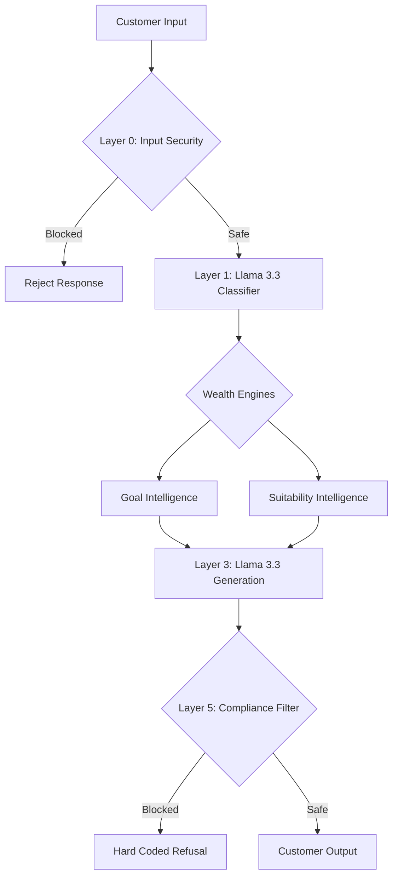

# NorthStar Wealth Companion


An AI-powered Wealth Management interface built for the modern Indian investor. Designed as a Proof of Concept for the IDBI Innovate Hackathon.

## Project Overview

This solution was inspired by recurring investor behaviors observed through real-world wealth management experience.

Across thousands of customer interactions, we found that investors rarely ask technical financial questions. Instead, they ask practical life questions:

- Can I buy a house in 10 years?
- Am I saving enough for retirement?
- Should I continue my SIP during market corrections?
- What should I do with my bonus?

We also observed that SIP discontinuation is often caused not by market fear, but by life events such as medical emergencies, cash-flow stress, and unexpected financial obligations.

Existing wealth platforms focus on recommending products.

**IDBI Wealth Companion focuses on helping investors stay on track.**

By combining goal-based planning, financial resilience assessment, behavioral coaching, investor education, and governance-aware AI, the platform helps customers build long-term financial confidence while remaining compliant, explainable, and scalable for digital banking environments.

> [!NOTE]
> Built from real investor conversations. Designed for real financial outcomes.

## Field Observations Behind The Product

The solution is built around four recurring investor patterns observed during real-world customer interactions.

### 1. SIP Resilience
Investors frequently stop SIPs because of life events rather than market volatility. Ensuring adequate emergency buffers prevents panic liquidations.

### 2. Goal Language
Investors think in life goals (e.g., "Child's Education", "Retirement") rather than financial products (e.g., "Flexi-cap Equity Fund").

### 3. Behavioral Biases
FOMO, herd mentality, recency bias, and panic selling repeatedly influence decision-making. 

### 4. Financial Literacy
Simple mental models consistently outperform financial jargon in improving understanding.

---

## Core Differentiator

Most wealth platforms focus on investment recommendations. **IDBI Wealth Companion focuses on investment continuity.**

The platform attempts to answer a different question: *"Can this investor remain invested when life becomes difficult?"*

The underlying **Financial Resilience Engine** evaluates:
- Emergency fund adequacy
- SIP continuity risk
- Cash-flow stress
- Life-event disruptions

before delivering wealth guidance.

## Human + AI

The Wealth Companion is designed to **augment, not replace, Relationship Managers (RMs).**

It extends personalized guidance to customers who may not have access to dedicated advisory services, while providing immediate escalation pathways when human intervention is required for complex or emotionally charged queries.

## Designed For IDBI Innovate 2026

The solution is designed as a Proof of Concept for the IDBI Innovate 2026 Wealth Advisory Challenge. Future sandbox integration is intended to leverage:
- Customer profile data
- Portfolio data
- SIP history
- Transaction history

to create a continuously evolving Financial Twin and personalized guidance experience.

---

## Architecture Philosophy



The AI model is intentionally treated as a **reasoning layer** rather than the source of financial guidance.

All responses are informed by:
- Financial Twin Context
- SEBI Governance Rules
- Behavioral Coaching Logic
- Financial Resilience Signals

This design allows the system to remain model-agnostic. Currently, the orchestrator utilizes **NVIDIA NIM** running `meta/llama-3.3-70b-instruct` for deterministic zero-shot classification and rigorous compliance-enforced generation.

## Testing Architecture & Quality Assurance

To ensure IDBI Wealth Companion survives rigorous, adversarial QA protocols (Hostile Judge scenarios), we implemented an enterprise-grade testing environment using **Vitest**:
- **Layer 0 & 5 Unit Tests:** Validates prompt injection blocking, empty payload rejections, and regex interceptions of SEBI-prohibited terms (e.g., "guarantee", "promise", "best fund").
- **Integration Tests:** Enforces the Suitability Engine's hard-rejection overrides (e.g., preventing high-risk asset generation for conservative profiles).
- **Mathematical Edge Cases:** Ensures the Goal Intelligence engine checks `freeCashFlow` deterministically, actively rejecting mathematically impossible financial goals.
- **State Machine Tests:** Validates race-condition recovery to prevent UI deadlocks during rapid message inputs or API timeouts.

## Hackathon Submission Framing

**1. Mobile Banking Integration Architecture**
> "The IDBI Wealth Companion presented in this POC is built as a highly responsive, standalone progressive web application (React/Next.js) strictly constrained to a mobile viewport. This design choice was made to rapidly demonstrate the core conversational capabilities and behavioral engines. However, the production target architecture is a **modular, drop-in SDK (Software Development Kit)** designed specifically for seamless embedding within IDBI's existing native mobile banking applications (iOS/Android). The UI components and chat interfaces are loosely coupled from the banking dashboard, ensuring the IDBI Mobile Team can import the `WealthCompanion` module without disrupting existing banking workflows."

**2. Behavioral Telemetry & Spending Habits Feed**
> "To deliver highly personalized, timely advice, the system relies on deep behavioral telemetry. In this sandbox phase, the cashflow profile (Monthly Outflows, EMI Burden, Discretionary Spend) is mocked via static persona generation to demonstrate the mathematical routing of the Central Nervous System (CNS) layer. For the final production rollout, this telemetry layer is architected to ingest live transaction feeds from IDBI's core banking databases. This enables the engine to automatically compute the customer's true spending habits and trigger real-time, proactive nudges (e.g., detecting a salary credit and immediately recommending a Step-Up SIP before the capital is spent)."

**3. Timely & Proactive Nudges (The "Timely" Requirement)**
> "Unlike traditional reactive chatbots, Dhan operates as a proactive wealth manager. The architecture includes a webhook-ready listener designed to trigger event-driven outreach. For example, the system monitors specific transaction events (like a large bonus credit or a missed SIP). When triggered, Dhan initiates the conversation, surfacing a push notification to the customer with personalized advice, transforming the wealth management experience from passive querying to active guidance."

## Running the Application

```bash
# Install dependencies
npm install

# Start the development server
npm run dev
```

Navigate to `http://localhost:3000` to interact with the application.

---

> [!IMPORTANT]
> **Legal and Licensing Information**
> Please review our [LEGAL_NOTICE.md](https://github.com/VIKAS9793/northstar-wealth-ai/blob/main/LEGAL_NOTICE.md) for important disclaimers regarding simulated financial data and SEBI compliance limitations. 
> Please review our [THIRD_PARTY_NOTICES.md](https://github.com/VIKAS9793/northstar-wealth-ai/blob/main/THIRD_PARTY_NOTICES.md) for trademark acknowledgments and open-source licenses.
