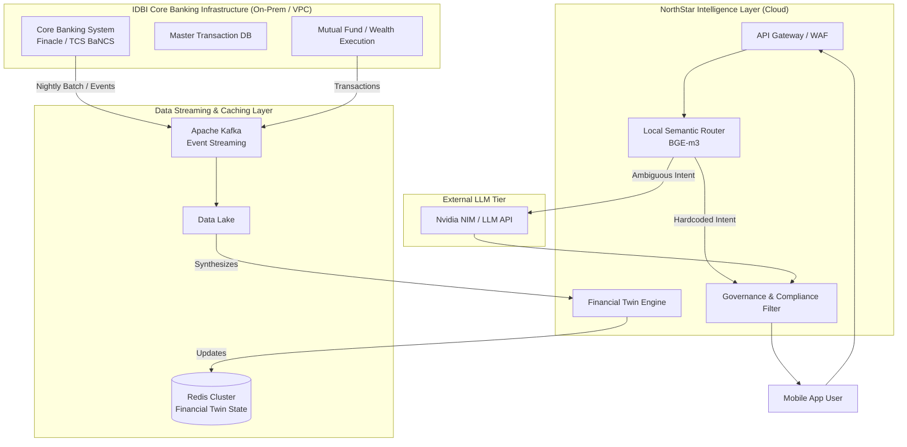
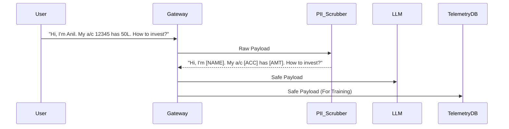

# 🚀 Scaling & Integration Architecture

*Document last updated: 2026-06-24*

> [!WARNING]
> **Projections Disclaimer**
> The scaling architectures and CCU projections detailed in this document are forward-looking models based on IDBI's current CBS footprint. They do not represent deployed, live-tested capacity.

> [!NOTE]
> **Executive Summary**
> The NorthStar Wealth Companion is designed not as a monolithic disruption, but as an **agile, decoupled intelligence layer**. It sits on top of IDBI's existing Core Banking System (CBS) and Mutual Fund execution infrastructure. This document outlines how we scale the current Proof of Concept (PoC) to millions of retail banking users with zero disruption to legacy infrastructure, minimal latency, and strict compliance.

---

## 🏗️ 1. Integration Architecture

To handle millions of Concurrent Users (CCU) without overloading the bank's legacy databases, the architecture relies on asynchronous data streaming and a decoupled "Financial Twin" caching layer.

> [!IMPORTANT]  
> **The Zero-Disruption Principle:** The AI Avatar *never* directly queries the Core Banking System in real-time. Instead, customer data is asynchronously synced to the Financial Twin (Redis cache). This ensures that even if the AI experiences massive traffic spikes, the core banking infrastructure experiences **zero additional load**.

---

## ⚡ 2. Technology Stack

Aligning with modern Indian banking standards, the stack transitions from the PoC to robust technologies:

| Component | PoC Stack | Target Stack | Justification |
| :--- | :--- | :--- | :--- |
| **Core Integration** | Mock JSON | Kafka + REST APIs | Asynchronous, event-driven syncing to avoid CBS strain. |
| **State Storage** | Local Browser State | Redis Cluster | Sub-millisecond latency for Financial Twin data. |
| **Intent Classifier** | Regex (Lexical) | BGE-m3 (Semantic Vectors) | Handles fluid Hinglish queries natively. |
| **LLM Inference** | Public LLM API | Self-Hosted Nvidia NIM | Data never leaves the banking Virtual Private Cloud (VPC). |
| **Execution** | Console Logs | BSE StarMF / IDBI APIs | Real-world transaction routing and SIP creation. |

---

## 📉 3. Cost Optimization at Scale

Running an LLM for millions of users is economically unviable if every query requires heavy compute. We solve this via a **Deflection-First Pipeline**.

> [!TIP]
> **How we reduce LLM costs by 80%:**
> 1. **Semantic Routing (L1):** 60% of banking queries are standard (e.g., "Check my balance", "How to save tax?"). Our local, lightweight Semantic Embedding model intercepts these mathematically and serves a pre-approved, cached response without ever waking up the heavy LLM.
> 2. **Telemetry Clustering:** Unanswered queries are logged, clustered, and converted into standard responses weekly. The more the system is used, the less it relies on the LLM.
> 3. **Context Pruning:** The LLM is never fed raw bank statements. The Financial Twin Engine pre-calculates insights (e.g., *Goal Probability = 78%*) and passes only these 5-6 condensed variables to the LLM. 

---

## 🛡️ 4. DPDP Act & SEBI Compliance (The Trust Layer)

Indian banking requires absolute regulatory adherence, particularly concerning the **Digital Personal Data Protection (DPDP) Act, 2023** and **SEBI** advisory rules.

### A. The Data Scrubbing Pipeline (DPDP)
Before any interaction is logged for model training or audit purposes, it must pass through a strict PII (Personally Identifiable Information) scrubber.

> [!WARNING]
> **Audit & Consent:** The UI will explicitly secure user consent during onboarding, notifying them that anonymized chat structures are used to improve the AI's contextual understanding. 

### B. SEBI-Aware Output Governance
The AI is strictly cordoned off from providing personalized advisory (stock picking, complex tax liability calculations).
* **Deterministic Fallbacks:** As built in the PoC, any detected advisory overreach triggers a hard fallback to human Relationship Managers.
* **Output Sweeping:** Every LLM generation is parsed through a compliance regex engine (L6) before hitting the user's screen. If the LLM hallucinates an exact return guarantee (e.g., "This fund will give you 12%"), the L6 filter kills the message.

---

## 📈 5. Continuous Improvement Loop

The NorthStar Companion becomes smarter not by changing code, but by analyzing aggregate user behavior.

1. **The Telemetry Lake:** All PII-scrubbed missed intents are dumped into a data lake.
2. **Weekly Clustering:** Automated clustering groups similar user questions (e.g., 50,000 users asking about "Gold Bonds" in Hinglish).
3. **RM Dashboard Review:** Product managers review these clusters and create new approved conversational paths.
4. **Vector DB Update:** The local Semantic Router is updated over-the-air, deflecting the LLM for these queries moving forward.

> [!IMPORTANT]
> By layering our solution over existing infrastructure, IDBI Bank gains an infinitely scalable Digital Wealth RM, transforming static transaction data into proactive, conversational coaching—with absolute data privacy, strict regulatory compliance, and a fraction of the computational cost.
