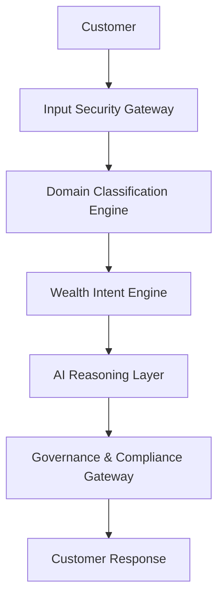

# NorthStar Wealth Companion

## AI Governance, Risk & Compliance Architecture

### SEBI-Aware Responsible Wealth Advisory Framework

---

# Governance Philosophy

The AI Wealth Companion is not allowed to function as an unrestricted generative AI system.

Every response must be:

* Explainable
* Auditable
* Traceable
* Accountable
* Suitability-Aware
* Compliance-Aware

> [!IMPORTANT]
> **Core Principle:** Safe advice is more important than smart advice.

---

# Governance Architecture

No response reaches the customer without passing through BOTH pre-generation and post-generation governance controls.

---

# Layer 1: Intent Classification Engine

Purpose: Determine what the customer is asking.

Categories:
* Goal Planning
* Investment Education
* Portfolio Review
* Risk Assessment
* SIP Management
* Financial Resilience
* General Query

High-Risk Categories:
* Product Recommendations
* Return Expectations
* Investment Switching
* Redemption Requests

---

# Layer 2: Suitability Validation Engine

Purpose: Prevent unsuitable guidance.

Inputs: Age, Risk Appetite, Financial Twin, Investment Horizon, Liquidity Needs, Dependents, Existing Portfolio.

Example:
Customer Age: 65
Request: "Put all my retirement money into aggressive small-cap funds."
Governance Response: Recommendation blocked due to suitability mismatch.

---

# Layer 3: Hallucination Prevention Layer

Purpose: Prevent fabricated information.

Allowed Sources: Structured financial twin, Product metadata, Rule-based outputs, Approved educational content.

Forbidden: Invented returns, Invented product performance, Unsupported claims, Fabricated risk metrics.

---

# Layer 4: Explainability Engine

Purpose: Every recommendation must explain itself.

Required Components:
1. Why was this recommendation generated?
2. Why does it fit this customer (Suitability)?
3. What risks exist?
4. What other options exist (Alternatives)?
5. What assumptions were used?

---

# Layer 5: Compliance Language Filter

Purpose: Detect prohibited advisory language.

> [!WARNING]
> **Forbidden Statements (Hard Rejected):**
> * Guaranteed returns
> * Assured wealth creation
> * Risk-free investment
> * Best fund
> * Highest return certainty

---

# Layer 6: Risk Disclosure Engine

Purpose: Automatically attach disclosures.

Examples:
* Historical performance does not guarantee future results.
* Investments are subject to market risks.

---

# Layer 7: Decision Audit Trail Engine

Purpose: Record how recommendations were generated for SEBI-Aware traceability.

---

# Layer 8: Human Escalation Framework

Purpose: Identify situations where AI should not act alone (e.g., Complex retirement planning, High-value customers) and route to Human RMs.

---

# Layer 9: Model Evaluation Framework

Purpose: Continuously measure AI quality (Accuracy, Suitability, Compliance, Explainability, Educational Value, Behavioral Impact).

---

# Layer 10: Red Team Testing Framework

Purpose: Stress-test the system against adversarial and behavioral edge cases.

**Expanded Red Teaming Test Suites (Vitest Execution):**
* Prompt Injection & Roleplay
* Bypassing Regex Heuristics
* Panic Selling Advice
* Specific Stock Picking
* Off-Topic Tasks
* False Positive Testing
* False Negative Testing
* Financial Hallucination Testing
* Suitability Violations
* Portfolio Switching Manipulation
* Product Recommendation Abuse

Expected Result: System refuses unsafe recommendations and provides compliant guidance.

---

# Governance Outcome

**Traditional AI Output Model:**
`User -> LLM -> Answer`

**NorthStar Wealth Companion Model:**
`User -> Input Filter -> Domain Router -> Intent Classifier -> AI Reasoning -> Suitability Validation -> Compliance Filter -> Audit Trail -> Customer`

**Result**: Explainable, Auditable, Accountable, Compliant, Trustworthy, Bank-Ready.
