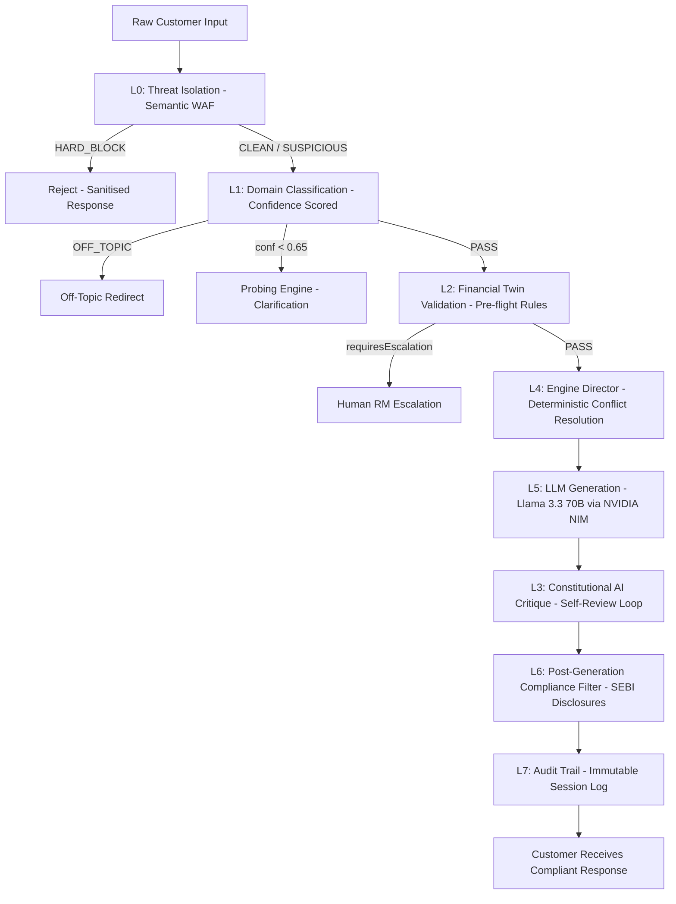

# NorthStar Wealth Companion

## AI Governance, Risk & Compliance Architecture

### Deterministic 7-Layer Constitutional AI Framework

---

## Governance Philosophy

The AI Wealth Companion is not allowed to function as an unrestricted generative AI system.

Every response must be:

- Explainable
- Auditable
- Traceable
- Accountable
- Suitability-Aware
- Compliance-Aware

> [!IMPORTANT]
> **Core Principle:** Safe advice is more important than smart advice. Governance is not a feature — it is the foundation.

---

## Architecture Overview

No response reaches the customer without passing through all active layers.

---

## Layer 0: Threat Isolation

**File:** `src/features/governance/threatIsolation.ts`

Purpose: Block adversarial inputs before they reach the LLM.

Detection Methods:
- 4 regex categories: `INSTRUCTION_OVERRIDE`, `PERSONA_SWITCH`, `SCOPE_EXFILTRATION`, `ADVERSARIAL_FRAMING`
- Jaccard similarity against 5 known jailbreak semantic anchors (threshold: 0.45)
- Length anomaly check: inputs over 800 characters flagged as `SUSPICIOUS`

Outputs: `CLEAN` | `SUSPICIOUS` | `HARD_BLOCK`

---

## Layer 1: Domain Classification with Confidence Scoring

**File:** `src/features/governance/domainClassifier.ts`

Purpose: Route intent with a measurable confidence score. Reject low-confidence inputs before the LLM fires.

Intent Types: `GOAL_PLANNING` | `RESILIENCE` | `EDUCATION` | `ACCELERATION` | `SUITABILITY_CHECK` | `CLARIFICATION` | `OFF_TOPIC` | `GENERAL`

Bias Detection: `LOSS_AVERSION` | `FOMO` | `HERD_MENTALITY` | `RECENCY_BIAS` | `OVERCONFIDENCE`

OOD Threshold: Inputs with confidence below 0.65 and no financial entities are routed to Probing.

Financial Entity Vocabulary: 30 terms. Each match boosts confidence by 0.04 (max +12%).

---

## Layer 2: Financial Twin Validation

**File:** `src/features/governance/financialTwinValidator.ts`

Purpose: Run deterministic pre-flight suitability checks against the customer's Financial Twin before the LLM receives any directive.

5 Pre-flight Rules:

| Rule | Condition | Severity |
|---|---|---|
| `FCF_ZERO_INVESTMENT_BLOCK` | Free cash flow <= 0 + investment intent | HARD_STOP |
| `EMERGENCY_FUND_PREFLIGHT` | Emergency fund < 3 months + non-RESILIENCE intent | SOFT_WARN |
| `SUITABILITY_HARD_STOP` | Conservative profile + SUITABILITY_CHECK intent | HARD_STOP |
| `SENIOR_PRESERVATION_MANDATE` | Age >= 60 + GOAL_PLANNING intent | SOFT_WARN |
| `EMI_BURDEN_ALERT` | EMI burden > 50% of income | SOFT_WARN |

A `HARD_STOP` combined with profile completeness below 60% triggers immediate RM escalation.

---

## Layer 3: Constitutional AI Critique

**File:** `src/features/governance/constitution.ts`

Purpose: The model critiques its own draft response against a Financial Advice Constitution before the customer sees it.

Process:
1. LLM generates a draft response (Pass 1)
2. Draft + Constitution sent back to LLM as a review task
3. LLM outputs: violations found, requires_revision flag, revised response
4. If revision required: revised text exits. If compliant: original text exits.
5. On any parse failure: original draft passes through — critique never blocks response.

The 8 Constitutional Principles:

- P1: No guaranteed / assured / risk-free return language
- P2: Suitability supremacy — all recommendations tied to risk profile
- P3: Disclosure completeness — past performance mentions need disclaimers
- P4: No specific securities endorsement without grounding
- P5: Assumption transparency — projections must state assumptions
- P6: Emotional neutrality — no stress-amplifying words in RESILIENCE responses
- P7: RM escalation availability in complex cases
- P8: Honest capability claims — no fake real-time data assertions

Critique model: `meta/llama-3.3-70b-instruct` at temperature 0.05 (near-deterministic). Fires for approximately 40% of interactions — gated by `requiresConstitutionalReview()`.

---

## Layer 4: Deterministic Engine Director

**File:** `src/features/governance/engineDirector.ts`

Purpose: Resolve conflicts between multiple active specialist engines before the LLM receives any directive.

Priority Order (1 = always wins):

1. SUITABILITY — overrides ACCELERATION, GOAL_PLANNING, EDUCATION
2. RESILIENCE — overrides ACCELERATION
3. PREFLIGHT — overrides ACCELERATION
4. GOAL_PLANNING — overrides PROBING
5. ACCELERATION
6. EDUCATION
7. PROBING — suppressed when any other engine fires

The LLM receives a single, ranked, unambiguous directive string. It never resolves engine conflicts itself.

---

## Layer 5: Tool-Use Output Schema

**File:** `src/features/governance/outputSchema.ts`

Purpose: Enforce a strict output contract. The LLM is only responsible for generating the `message` field.

Financial metrics (`goalProbability`, `requiredMonthlySIP`, `freeCashFlow`) are pre-computed deterministically from the Financial Twin and never generated by the LLM.

Compliance and governance metadata fields are injected by L6 and L7 respectively.

---

## Layer 6: Post-Generation Compliance Filter

**File:** `src/features/governance/complianceFilter.ts`

Purpose: Detect prohibited language and inject mandatory SEBI-aware disclosures based on the response intent.

> [!WARNING]
> **Forbidden Statements (Hard Rejected):**
> - Guaranteed / assured / risk-free / certain returns
> - "This fund will" / "You will definitely" / "Sure shot"
> - "Best fund" / "No. 1 fund" / "Cannot lose"

Whitelist: Protective phrasing (`cannot guarantee`, `subject to market risk`) passes through.

Mandatory Disclosures by Intent:

| Intent | Disclosure |
|---|---|
| GOAL_PLANNING | Projection disclaimer + scheme document reminder |
| RESILIENCE | Past performance disclaimer + SIP continuity note |
| ACCELERATION | Step-up SIP risk note + RM consultation suggestion |
| SUITABILITY_BLOCK | Risk profile revision pathway |
| EDUCATION | Informational purpose only |

---

## Layer 7: Audit Trail Engine

**File:** `src/features/governance/auditTrail.ts`

Purpose: Record every governance decision made during request processing for bank-grade auditability.

Each `AuditEntry` captures:
- Threat assessment result and category
- Classification intent, bias, confidence, and financial entities extracted
- Financial Twin snapshot at time of request
- All engines fired and suppressed
- Pre-flight blocks triggered
- Whether constitutional review ran and what violations were found
- Compliance violations and disclosures injected
- Final response delivered to customer
- Whether the request was blocked

Storage: In-memory session map for prototype. Production target: `POST /api/idbi/audit/wealth-ai`.

Console format: `[AUDIT] {auditId} | {intent} | conf:{confidence} | blocked:{wasBlocked}`

---

## Governance Outcome

**Traditional AI Output Model:**
`User -> LLM -> Answer`

**NorthStar Wealth Companion Model:**
`User -> L0 Threat Gate -> L1 Intent Router -> L2 Twin Validator -> L4 Engine Director -> L5 LLM -> L3 Constitutional Critique -> L6 Compliance Filter -> L7 Audit Trail -> Customer`

**Result:** Explainable, Auditable, Accountable, Compliant, Trustworthy, Bank-Ready.
